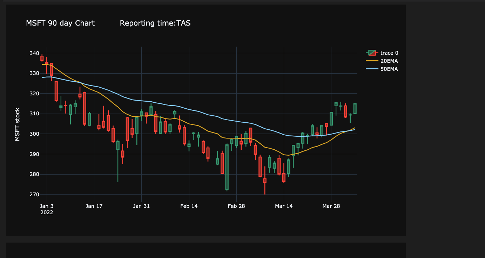

# Earnings Watchlist Bot 
  
**This application will:**
###### -retrieve companies **reporting** earnings on a given date
###### - trim top 8 companies based on marketcap
###### - calculate 20 Day and 50 Day exponential moving average
###### - render 90 day candlestick chart for top 8 ticker symbols 
#####  
## Dependencies:
##### Python modules: Pandas, Requests,Selenium, Plotly
##### Yahoo Finance API key - free to create account
##### Create config.py file containing varible named 'api_key' assigning it your api key
#####  
## Usage:
##### Open driver.ipynb in a environment that supports jupyter notebooks
##### Select the 'Run All' button

